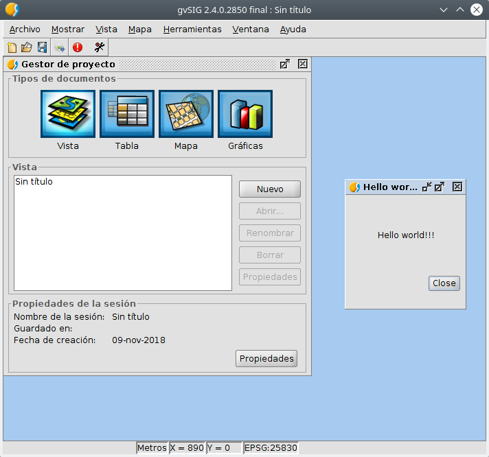

 
Hello world!!
====================

This would be an example of a script for gvSIG desktop 2.4.

We must remember to add:

- A license file
- A file with documentation, with at least a brief description of what our script does and a screenshot to help identify the tool we have developed.

It is a script that shows a window with the message "Hello world!" and a "Close" button.

The window will close when you click on the "Close" button.
