.. contents::
 
Publicar mi script
===================

Hola a todos.

En las ultimas versiones de gvSIG, 2.3 y 2.4, los usuarios avanzados
se han ido animando a ir haciendo sus pequeñas utilidades usando
la herramienta de scripting. Ultimamente nos han llegado peticiones
para que incluyamos sus scripts en el repositorio de complementos
de *gvSIG desktop*.

Los scripts, nos los han enviado casi de cualquier forma, normalmente
por correo y en algun zip en el que estaban los fuentes, y en
ocasiones alguna documentacion para el usuario, o indicaciones de
como instalarlo. La diversidad en las formas en las que nos han
hecho llegar las colaboaraciones nos hace muy dificil manejarlas
y poder incluirlas todas en el repositorio de complementos de *gvSIG desktop*.

Voy a contar como, usando *GitHub*, podemos
manajar nuestros scripts y crear una distribucion que resulte
simple luego aportar al proyecto como una colaboracion de la comunidad.
Para ello voy a usar un ejemplo muy simple. Un script que al ejecutarlo
muestra una ventana con un mensaje, *"Hello world!!"*, y un par de botones,
"Close" y "View PDF", que cierran la ventana y abren un PDF con informacion
al usuario respectivamente.

Lo primero, crearemos una carpeta dentro de *"User/addons"* para nuestro
script. En mi caso la llamare *"HelloWorld"*, y dentro de ella pondremos 
nuestro script. Ademas de nuestro script, con todos los fichero que 
precise este, deberemos incluir al menos dos ficheros mas:

- **LICENSE.txt**, que contendra la licencia con la que vamos a distribuir
  nuestro script, normalmente GPL 3 o alguna variante de *Creative Commons*.
  
- **README.rst**, que contendra una breve descripcion de nuestra utilidad, en 
  la que es recomendable incluir alguna captura de pantalla que ayude a los
  usuarios a identificarla.

En el caso del ejemplo tendremos los siguientes ficheros:

- doc
  - captura1.png
  - helloworld.pdf

- helloworld (.py/.inf)
- helloworld.xml
- LICENSE.txt
- README.rst

Si escribimos la documentacion en *RestructuredText* (.rst), nos puede ser util una pequeña
gui de este lenguaje de marcas. Podemos encontrar muchas en internet, pero para que no tengais
que buscar os dejo aqui enlace a una de ellas:

http://www.sphinx-doc.org/en/master/usage/restructuredtext/basics.html

Creacion del repositorio en GitHub
------------------------------------

Como he comentado mas arriba, vamos a usar *GitHub* para gestionar nuestro script,
asi que nos dirigiremos a http://github.com, y si no tenemos creado un usuario lo crearemos.

Con un usuario ya creado, pasaremos a crear un nuevo repositorio para nuestro script. Normalmente,
y una vez ya identificados en la web de *GitHub*, nos aparecera en algun punto un boton verde que
dice algo como *"New repository"*. Pulsaremos en él y en la pagina que nos aparecera indicaremos
el nombre del nuevo repositorio, en mi caso lo llamare igual que la carpeta de mi sccript, *HelloWorld*,
y luego pulsaremos en el boton *"Create repositorio"*, hacia el final de la pagina.

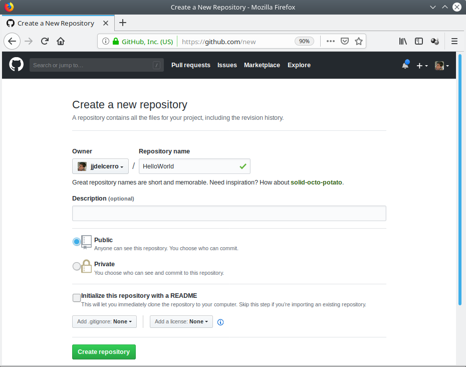

Una vez creado nuestro repositorio nos aparecera algo parecido a esto:

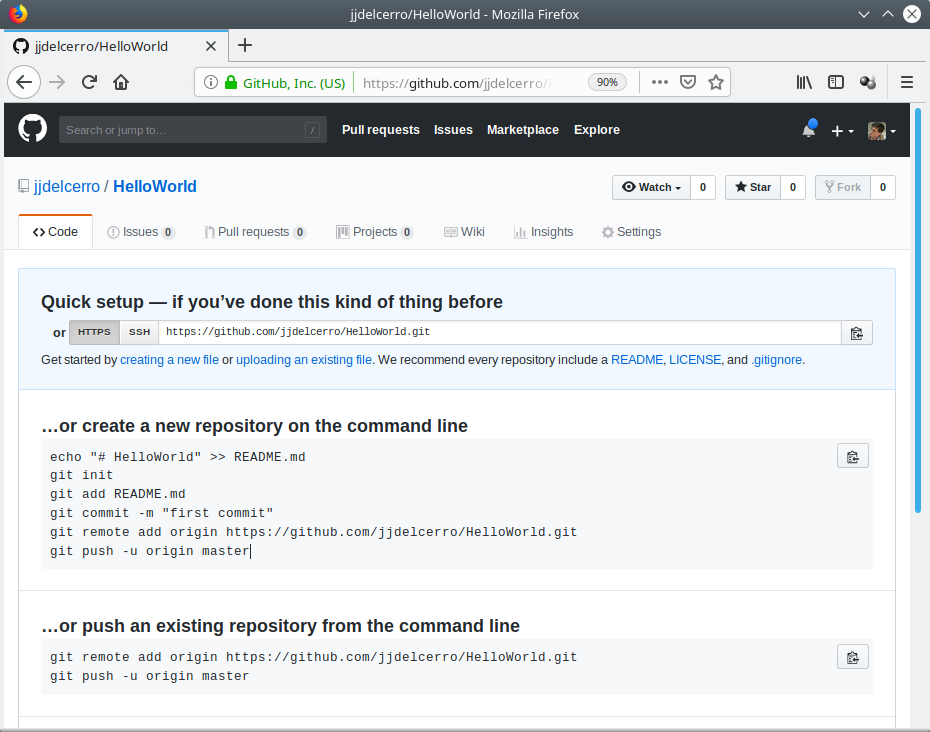

Preparar nuestro repositorio local
----------------------------------------------

Con el repositorio de GitHub ya creado pasaremos a obtener una copia de este en nuestra maquina.

Copiaremos la direccion que aparecia en la caja de texto bajo "**Quick setup**", podemos utilizar el 
boton que hay a la derecha de esta para hacerlo. Volveremos al *Editor de scripts*
de gvSIG desktop, selccionaremos en el arbol de la izquierda la carpeta 
de nuestro script, "HelloWorld", y activaremos la opcionde menu 
*"Herramientas/Git/Clone..."*. 
 
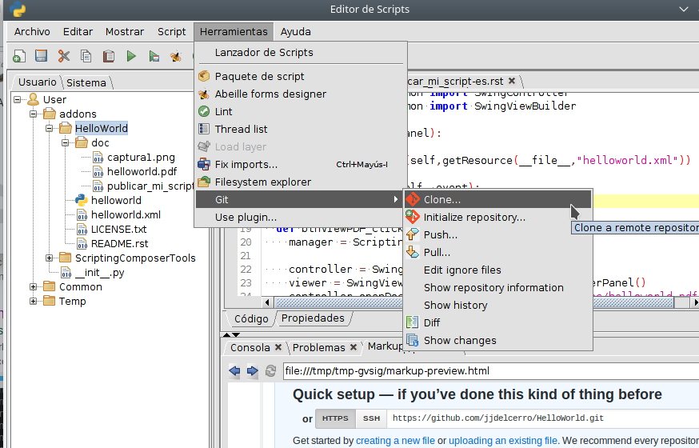

Nos aparecera el siguiente cuadro de dialogo, en el que pegaremos en la
caja de texto "Repository URL" la direccion que copiamos de nuestro repositorio
de GitHub.

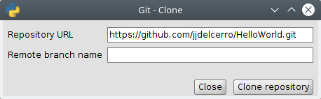

Y pulsaremos en el boton "Clone repository".

Una vez terminada la operacion nos quedara la ventana algo como:

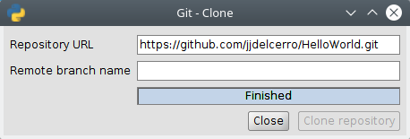

Y pulsaremos el boton "Close".

Ahora pasaremos a guardar nuestro script en el repositorio local
que acabamos de crear y luego lo sincronizaremos con el de GitHub.

Teniendo seleccionada en el "arbol" la carpeta de nuestro scritpt
activaremos la herramienta "Herramientas/Git/Show changes".

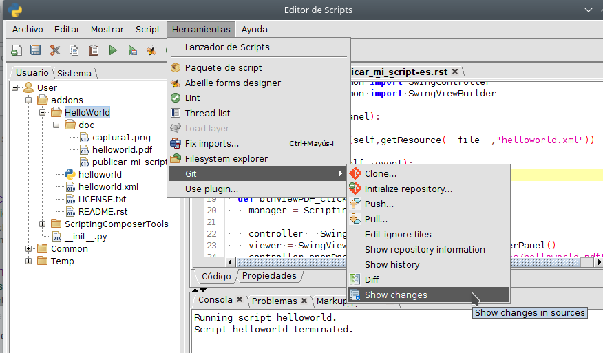

Y en la parte inferior de la ventana del editor aparecera una
pestaña nueva, "Git changes" con la informacion de cambios
que hay entre el repositorio local de Git que acabamos de crear
y los fuentes de nuestro script.

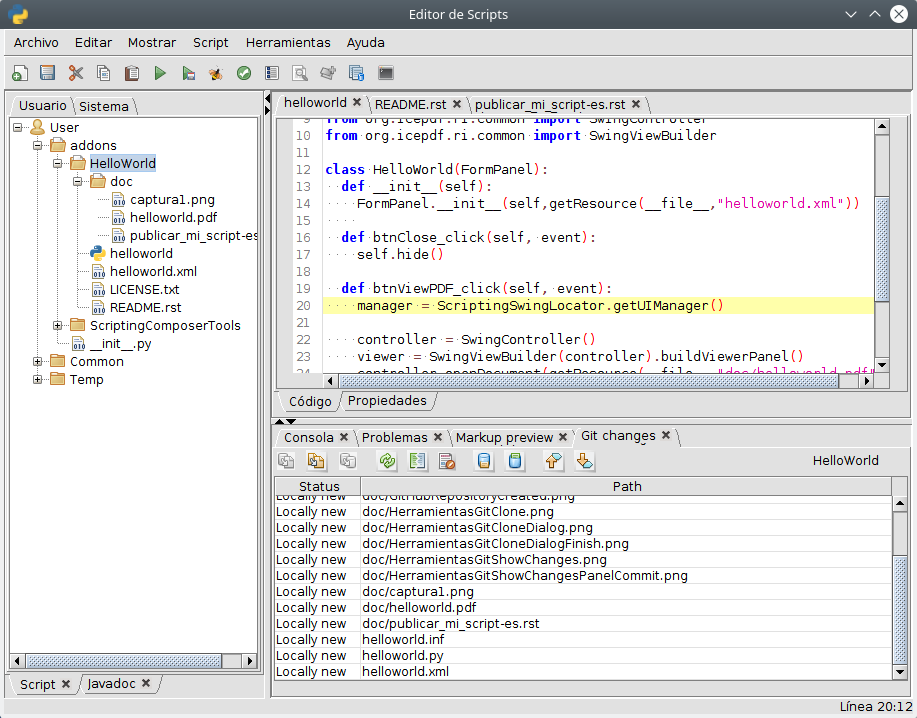

Seleccionaremos todos los ficheros en la tabla de cambios (podemos 
usar las teclas shift y control en conjuncion con el raton para ello),
y pulsaremos el boton "Commit all/selecteds".

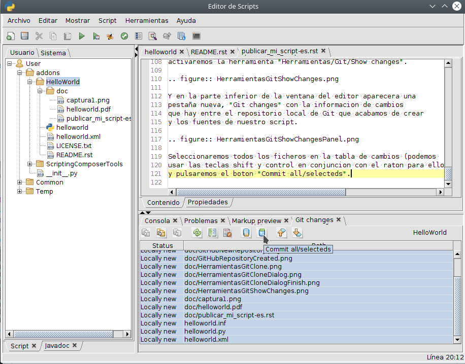

Una vez terminada la operacion la tabla de la pestaña de cambios 
estara vacia (si no lo esta podemos pulsar el boton "Refresh status").

Entonces pulsariamos el boton "Push" para actualizar los datos en GitHub.

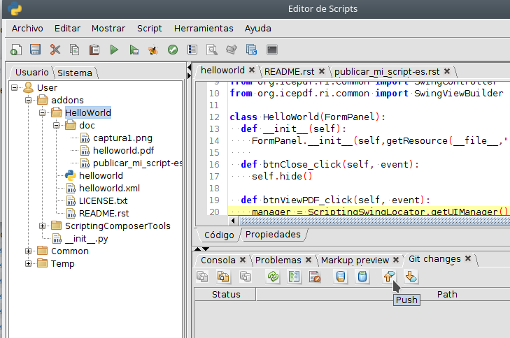

Aparecera un dialogo en el que deberemos introducir nuestro
usuario y contraseña de GitHub y pulsaremos en el boton "Push"
del dialogo. Al terminar la operacion el dialogo quedara algo
como:

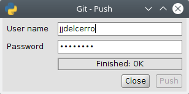

Y si volvemos a GitHub, a la pagina del proyecto que habiamos
creado y le damos actualizar apareceran ya los fuentes.

.. figure:: GitHubMyRepository.png

Actualizar el repositorio de GitHub
----------------------------------------------

A partir de aqui, iremos haciendo cambios en nuestro codigo, y utilizando la
herramienta de "Show changes", iremos viendo los cambios y "commitandolos"
a nuestro repositorio local. Y cuando queramos usaremos el boton "Push"
para subir esos cambios a "GitHub".

Crear una "release"
---------------------

Para crear una revision de nuestro script, tendremos que hacer varias cosas.
Lo primero crearemos un paquete con nuestro script. Usaremos la herramienta
"Herramientas/Paquete de script" del editor de scripts.

En el dialogo "Empaquetador de scripts" seleccionaremos la carpeta de nuestro
script.

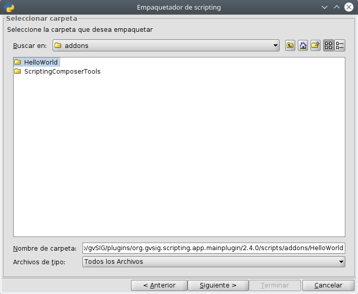

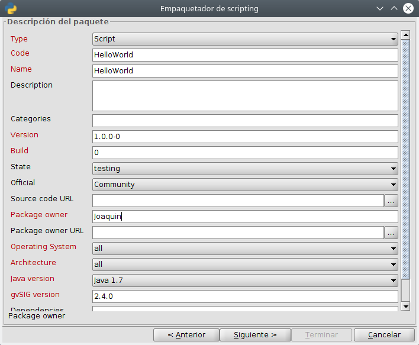

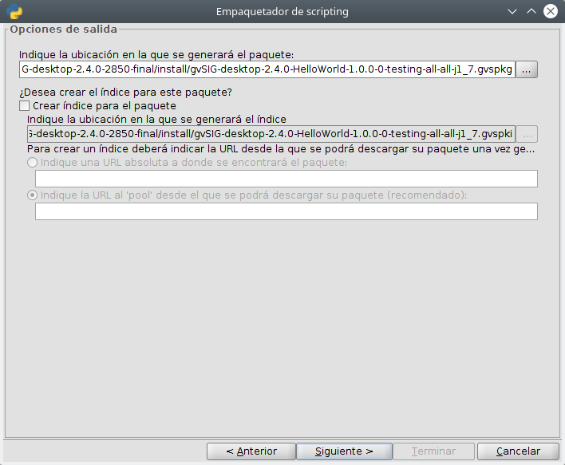

Y una vez termine cerraremos la ventana con el boton "Terminar".

