.. contents::

.. _GitHub : http://github.com
.. _`gvSIG desktop` : http://www.gvsig.com/es/productos/gvsig-desktop
.. _RestructuredText : http://docutils.sourceforge.net/docs/ref/rst/restructuredtext.html

Publicar mi script
===================

Hola a todos.

En las ultimas versiones de gvSIG, 2.3 y 2.4, los usuarios avanzados
se han ido animando a ir haciendo sus pequeñas utilidades usando
la herramienta de scripting. Últimamente nos han llegado peticiones
para que incluyamos sus scripts en el repositorio de complementos
de `gvSIG desktop`_.

Los scripts, nos los han enviado casi de cualquier forma, normalmente
por correo y en algún zip en el que estaban los fuentes, y en
ocasiones alguna documentación para el usuario, o indicaciones de
como instalarlo. La diversidad en las formas en las que nos han
hecho llegar las colaboraciones nos hace muy difícil manejarlas
y poder incluirlas todas en el repositorio de complementos de `gvSIG desktop`_.

Voy a contar como, usando GitHub_, podemos
manejar nuestros scripts y crear una distribución que resulte
simple luego aportar al proyecto como una colaboración de la comunidad.
Para ello voy a usar un ejemplo muy simple. Un script que al ejecutarlo
muestra una ventana con un mensaje, *"Hello world!!"*, y un par de botones,
*"Close"* y *"View PDF"*, que cierran la ventana y abren un PDF con información
al usuario respectivamente.

Lo primero, crearemos una carpeta dentro de *"User/addons"* para nuestro
script. En mi caso la llamare *"HelloWorld"*, y dentro de ella pondremos 
nuestro script. Ademas de nuestro script, con todos los fichero que 
precise este, deberemos incluir al menos dos ficheros mas:

- **LICENSE.txt**, que contendrá la licencia con la que vamos a distribuir
  nuestro script, normalmente GPL 3 o alguna variante de *Creative Commons*.
  
- **README.rst**, que contendrá una breve descripción de nuestra utilidad, en 
  la que es recomendable incluir alguna captura de pantalla que ayude a los
  usuarios a identificarla.

En el caso del ejemplo tendremos los siguientes ficheros:

- doc

  - captura1.png
  - helloworld.pdf

- helloworld (.py/.inf)
- helloworld.xml
- LICENSE.txt
- README.rst

Si escribimos la documentación en RestructuredText_ (.rst), nos puede ser útil tener a mano la
guiá de este lenguaje de marcas. Podemos encontrar muchas en Internet, pero para que no tengáis
que buscar os dejo aquí enlace a una de ellas:

http://docutils.sourceforge.net/docs/user/rst/quickref.html

Creacion del repositorio en GitHub
------------------------------------

Como he comentado mas arriba, vamos a usar GitHub_ para gestionar nuestro script,
así que nos dirigiremos a http://github.com, y si no tenemos creado un usuario lo crearemos.

Con un usuario ya creado, pasaremos a crear un nuevo repositorio para nuestro script. Normalmente,
y una vez ya identificados en la web de *GitHub*, nos aparecerá en algún punto un botón verde que
dice algo como **"New repository"**. Pulsaremos en él y en la pagina que nos aparecerá indicaremos
el nombre del nuevo repositorio, en mi caso lo llamare igual que la carpeta de mi sccript, *HelloWorld*,
y luego pulsaremos en el botón "**Create repositorio**", hacia el final de la pagina.

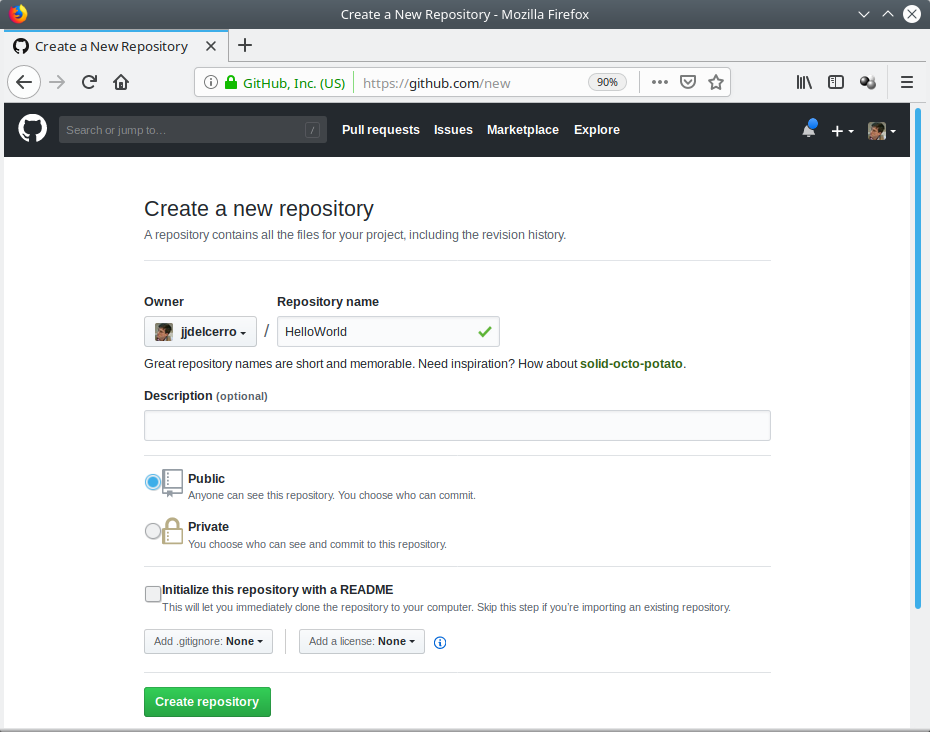

Una vez creado nuestro repositorio nos aparecerá algo parecido a esto:

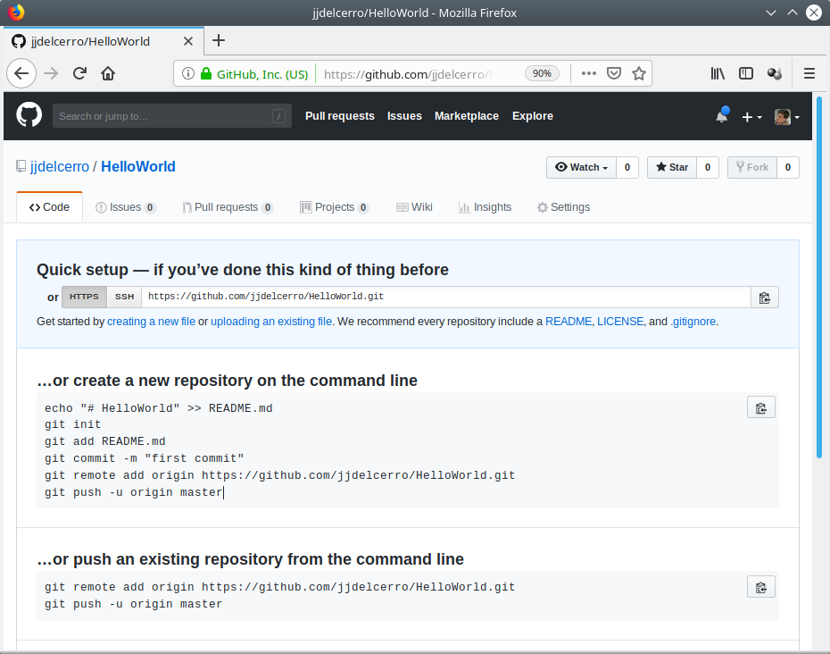

Preparar nuestro repositorio local
----------------------------------------------

Una vez tenemos el repositorio creado en GitHub_ tendremos que crear una copia en local de él.

Copiaremos la dirección que aparecía en la caja de texto bajo "**Quick setup**", podemos utilizar el 
botón que hay a la derecha de esta para hacerlo. Volveremos al *Editor de scripts*
de `gvSIG desktop`_, seleccionaremos en el árbol de la izquierda la carpeta 
de nuestro script, *"HelloWorld"*, y activaremos la opción de menú 
|gitClone| *"Herramientas/Git/Clone..."*. 
 
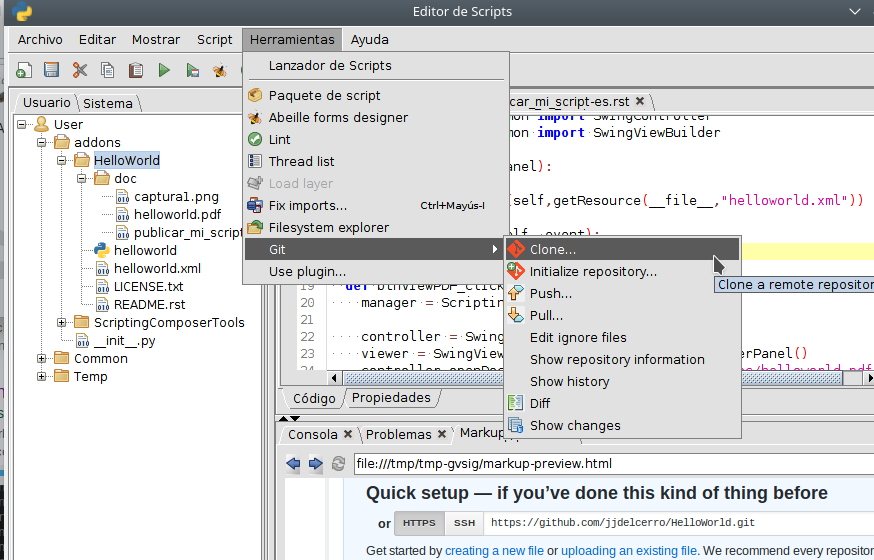

Esta herramienta nos presentara un cuadro de dialogo en el que pegaremos, en la
caja de texto "Repository URL", la dirección que copiamos de nuestro repositorio
de GitHub_.

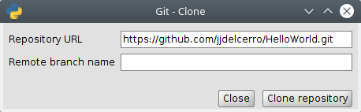

Y pulsaremos en el botón *"Clone repository"*.

Una vez terminada la operación nos quedara la ventana algo como:

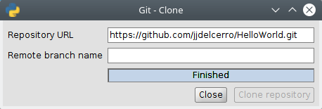

Y pulsaremos el botón *"Close"*.

Ahora pasaremos a guardar nuestro script en el repositorio local
que acabamos de crear y luego lo sincronizaremos con GitHub_.

Teniendo seleccionada en el *"árbol"* la carpeta de nuestro script
activaremos la option de menu |gitShowChanges| *"Herramientas/Git/Show changes"*.

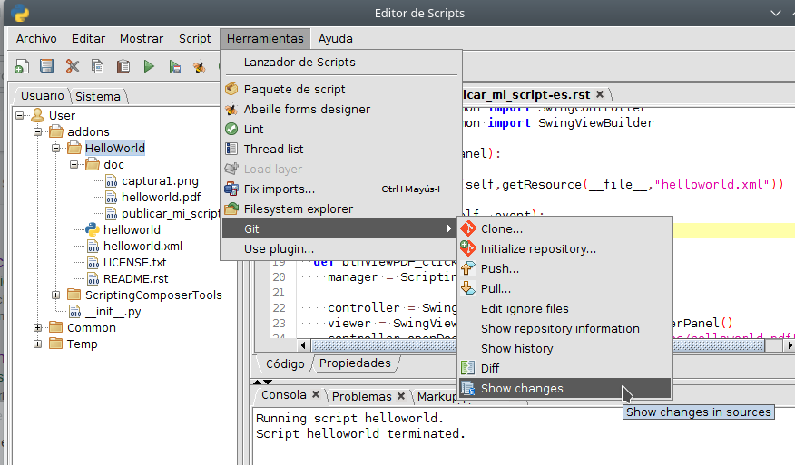

Y en la parte inferior de la ventana del editor aparecerá una
pestaña nueva, **"Git changes"** con la información de cambios
que hay entre el repositorio local de Git que acabamos de crear
y los fuentes de nuestro script.

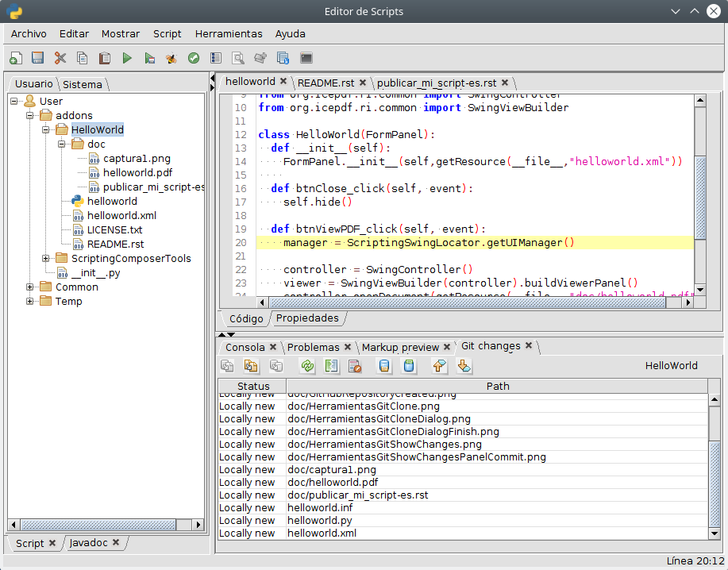

Seleccionaremos todos los ficheros en la tabla de cambios (podemos 
usar las teclas shift y control en conjunción con el ratón para ello),
y pulsaremos el boton |gitCommit| **"Commit all/selecteds"**.

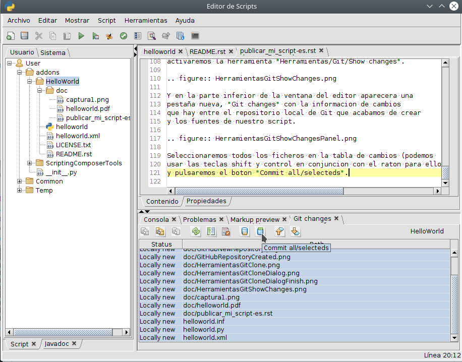

Una vez terminada la operación la tabla de la pestaña de cambios 
estará vaciá (si no lo esta podemos pulsar el botón |gitRefreshStatus| *"Refresh status"* ).

Entonces pulsariamos el botón |gitPush| *"Push"* para actualizar los datos en GitHub.

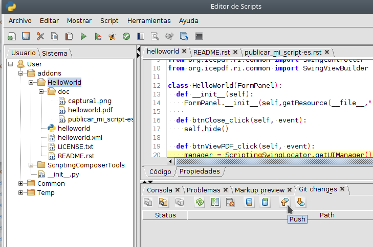

Aparecerá un dialogo en el que deberemos introducir nuestro
usuario y contraseña de GitHub_ y pulsaremos en el botón **"Push"**
del dialogo. Al terminar la operación el dialogo quedara algo
como:

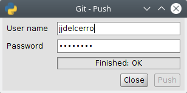

Y si volvemos a GitHub_, a la pagina del proyecto que habíamos
creado y le damos actualizar aparecerán ya los fuentes.

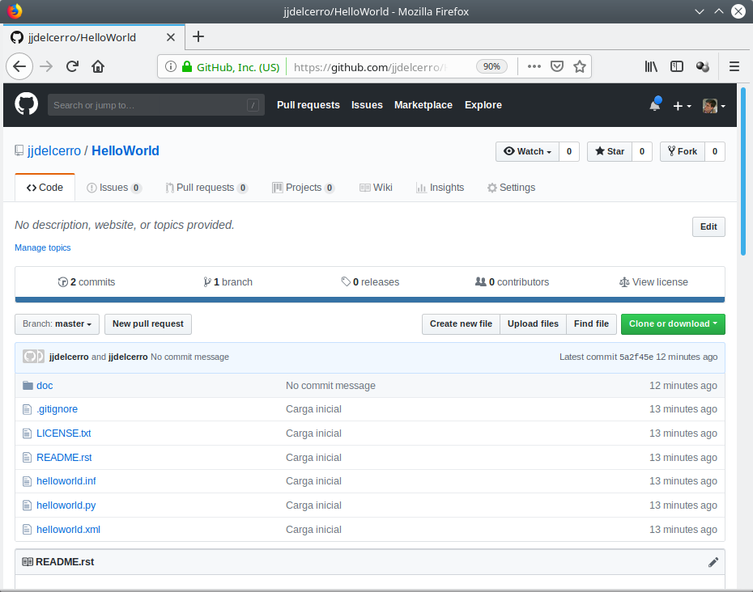

Actualizar el repositorio de GitHub
----------------------------------------------

A partir de aquí, iremos haciendo cambios en nuestro código, y utilizando la
herramienta de |gitShowChanges| *"Show changes"*, iremos viendo los cambios y "commitandolos"
a nuestro repositorio local. Y cuando queramos usaremos el botón |gitPush| **"Push"**
para subir esos cambios a GitHub_.

Crear una "release"
---------------------

Para crear una revisión de nuestro script, tendremos que hacer varias cosas.
Lo primero crearemos un paquete con nuestro script. Usaremos la opción de menú
**"Herramientas/Paquete de script"** del editor de scripts.

En el dialogo *"Empaquetador de scripting"* seleccionaremos la carpeta de nuestro
script.

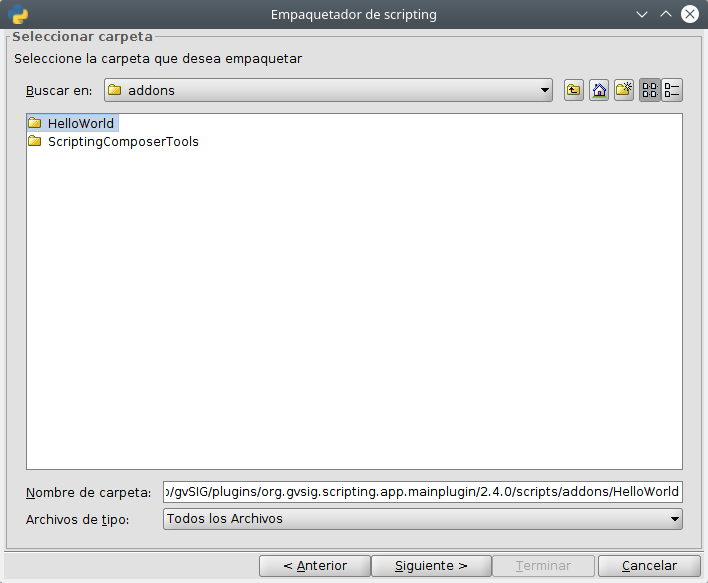

Luego nos presentara un formulario en el que encontraremos entre otras cosas:

- **Code**, aquí deberíamos poner el mismo nombre que la carpeta en donde esta nuestro
  script, y que normalmente estará puesto de forma automática.
  
- **Name**, aquí ira el nombre que se mostrara en el administrador de complementos. Suele
  asignarse un valor por defecto para este campo.

- **Description**. Podremos poner aquí una descripción breve de nuestro script. Debe ser 
  *texto plano*, pudiendo contener retornos de linea.
  
- **Categories**.  Aquí irán las categorías o etiquetas asociadas al complemento. Estas se
  muestran en el administrador de complementos y permite filtrar por ellas.

- **Version**. Se trata de un campo muy importante. No deberán rengarse dos revisiones con el 
  mismo numero de versión. El formato es de tres números separado por puntos y un cuarto al 
  final separado por un guion que debe corresponderse con el numero de build. El valor inicial es 
  de 1.0.0-0
  
- **Build**, debe asignarse el mismo numero que el indicado en numero mas a la derecha del numero de
  version.
  
- **State**, se trata de una etiqueta especial que indica al usuario el estado de estabilidad del
  complemento. Si se asigna a *"devel"*, se mostrara un mensaje de aviso al usuario que esta instalando
  complementos que aun están en desarrollo. Lo normal seria *"testing"* o *"final"*.
  
- **Oficial**. Aquí deberemos indicar *"Comunity"*, que es el valor por defecto, salvo que 
  desde el proyecto se indique otra cosa.
  
- **Package owner**. Este es un campo obligatorio que no viene relleno por defecto. Indicaremos
  el nombre del creador del paquete.

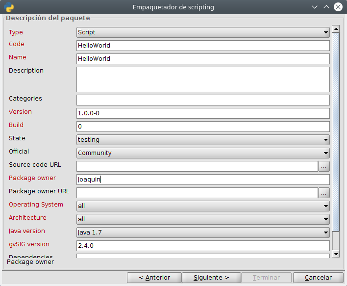

Una vez rellenos los campos pulsaremos en "**Siguiente**", y nos presentara las "**Opciones de salida**"
que vamos a usar en la creación del paquete. En esta primera vez, lo aconsejable es dejar los
valores por defecto, que crearan un fichero "**gvspkg**".

.. figure:: publish_my_script/HerramientasPackageWizard3.png
   :align: center

Es muy importante que en esta ocasión, solo generemos el fichero "**gvspkg**". No marquemos el 
*check* crear indice para el paquete, ya que en este momento aun no sabemos la URL que debemos 
indicar.

Le daremos "**Siguiente**", y una vez termine cerraremos la ventana con el botón "**Terminar**".

Una vez creado el paquete, deberemos localizarlo, normalmente en la carpeta
install de la instalación de gvSIG, en mi caso tengo un fichero::

  gvSIG-desktop-2.4.0-HelloWorld-1.0.0-0-testing-all-all-j1_7.gvspkg

Ahora iremos a la pagina web de GitHub_ de nuestro proyecto. Veremos que 
en la parte de arriba tenemos un enlace que dice "**Releases**" y pulsaremos
en el para acceder a la pagina que nos permitirá crear la primera revisión
de nuestro script.

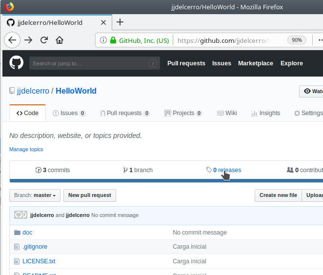

En esta pagina pulsaremos en el botón de "**Create a new release**" para acceder
al formulario que nos pedirá los datos de la revisión.

Tendremos que introducir valores para:

- **Tag version**. Introduciremos la misma versión que indicamos en la
  creación del paquete, que figura también en el nombre del fichero "gvspkg",
  en mi caso "1.0.0-0". 
  
- **Release title**, aquí introduciremos el nombre del fichero *"gvspkg"* sin 
  la extensión

- **Describe this release**. Opcionalmente aquí podremos introducir una pequeña descripción
  que se mostrara en GitHub_ .

- **Atach binaries...**, sobre esta área arrastraremos el fichero *gvspkg* que hemos
  creado desde el editor de scripts.

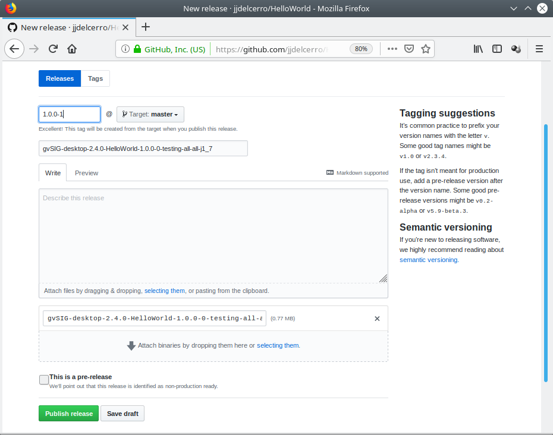

Una vez rellenados estos datos pulsaremos el botón "**Publish release**" para crear la revisión
en GitHub_ .

Con esto tendríamos ya creada la revisión, pero aun faltaría algo mas para
poder incluirla fácilmente en el repositorio de complementos de `gvSIG desktop`_.

Deberemos crear un paquete "gvspki".
Para eso, tendremos que hacer algunas cosas mas ya que en este debe incluirse
la URL de donde poder descargar el fichero *gvspkg*. 

Por un lado nos quedaremos con la URL, que copiaremos de la pagina de GitHub_ donde 
se muestra la revisión que acabamos de crear. 

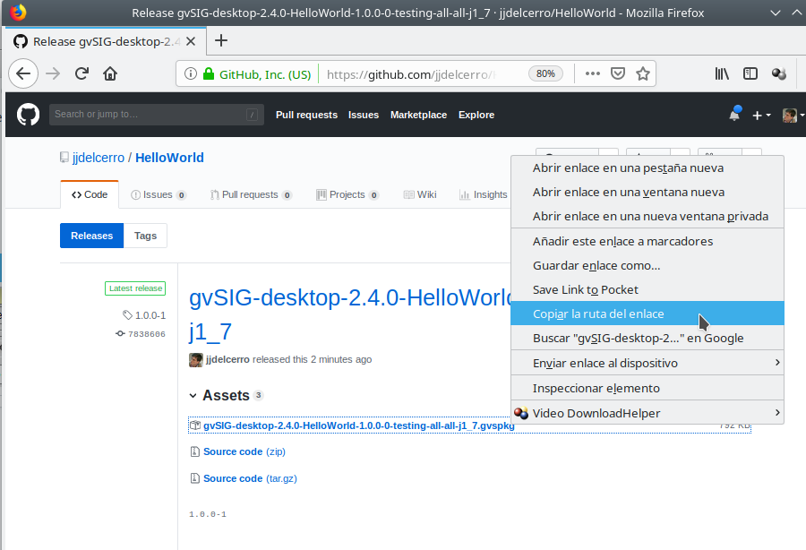

Una vez tenemos esa URL, volveremos a la herramienta "**Herramientas/Paquete de script**" del 
editor de scripts. Seleccionaremos la carpeta de nuestro script, y daremos
siguiente hasta llegar al paso "**Opciones de salida**". En esta ocasión, si modificaremos
los valores que nos ofrece. Marcaremos la casilla **Crear indice para el paquete**,
y mas abajo "**Indicar una URL absoluta a donde se encontrara el paquete**" y en el cuadro
de texto bajo este pegaremos la URL que hemos copiado de GitHub_ .

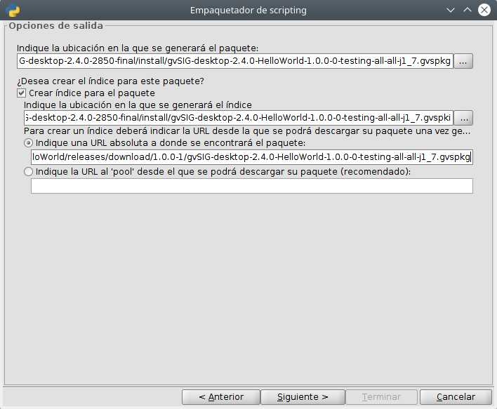

Le daremos "**Siguiente**", y una vez termine cerraremos la ventana con el botón "**Terminar**".
Esto habrá generado un fichero *gvspki*, junto al fichero *gvspkg* que se creo antes.

Para acabar subiremos a la revisión del GitHUb_ el fichero *gvspki* que acabamos de crear.

Seleccionaremos la opción "**Edit release**" en la pagina web de GitHub_ donde se muestra
la revisión.

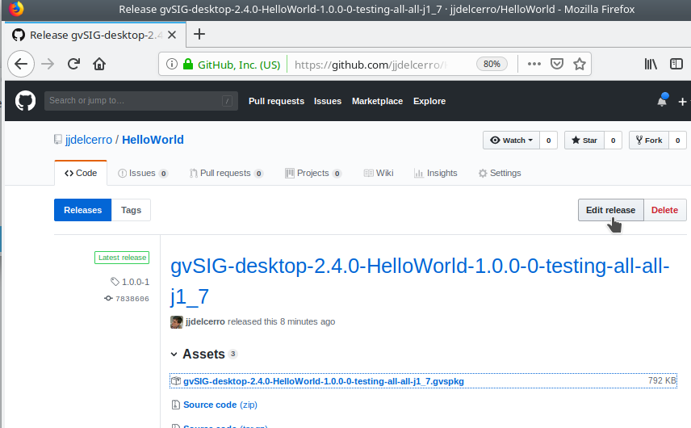

Y de forma similar a como subimos el *gvspkg* subiremos ahora el fichero "gvspki" como un nuevo 
binario. Una vez subido a la revisión y pulsaremos en el botón "**Update release**".

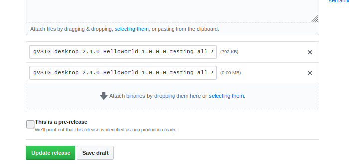

Ya solo nos queda una ultima cosa...

hacer llegar al proyecto gvSIG el enlace la revisión que acabamos de crear. Es muy importante
que la revisión contenga los ficheros, *gvspkg* y *gvspki* creados tal
como he indicado, de otra forma no podremos incluirla en el repositorio
de paquetes. Bastara con hacernos llegar la URL a la revisión en el GitHub_ , en mi caso::

  https://github.com/jjdelcerro/HelloWorld/releases/tag/1.0.0-1

Un saludo a todos

Joaquin
